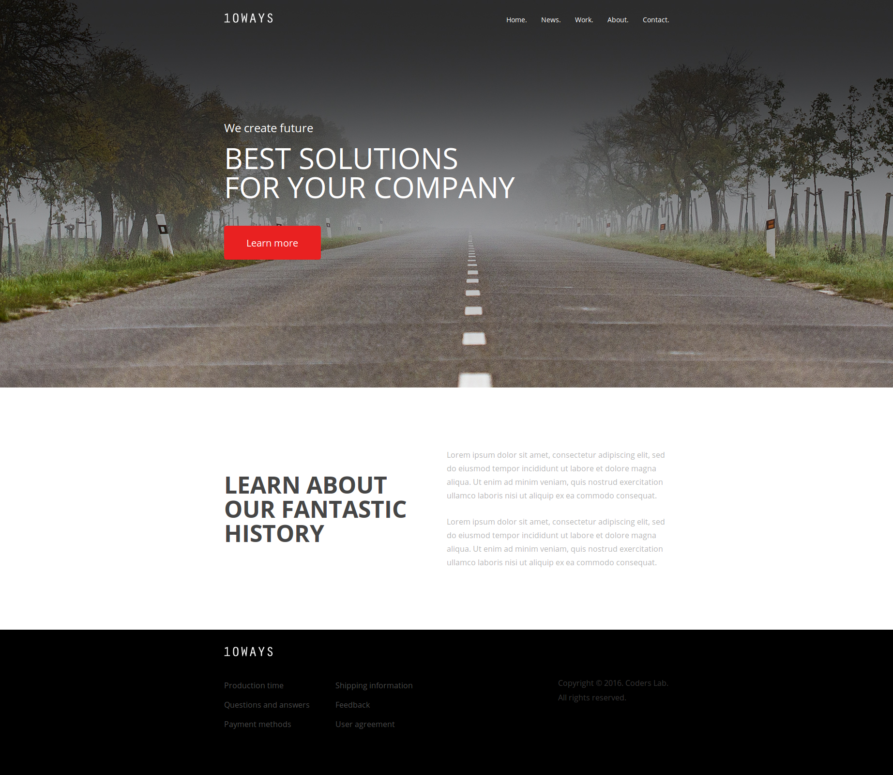

# Zaawansowany HTML i CSS &ndash; egzamin

## Stwórz stronę na podstawie poniższych wytycznych:

**Wytyczne dotyczące repozytorium**

1. Stwórz [*fork*](https://guides.github.com/activities/forking/) repozytorium z zadaniami.
2. Sklonuj repozytorium na swój komputer. Użyj do tego komendy `git clone adres_repozytorium`
Adres repozytorium możesz znaleźć na stronie repozytorium po naciśnięciu w guzik "Clone or download".
3. Rozwiąż zadania i skomituj zmiany do swojego repozytorium. Użyj do tego komend `git add nazwa_pliku`.
Jeżeli chcesz dodać wszystkie zmienione pliki użyj `git add .` 
Pamiętaj że kropka na końcu jest ważna!
Następnie skommituj zmiany komendą `git commit -m "nazwa_commita"`
4. Wypchnij zmiany do swojego repozytorium na GitHubie.  Użyj do tego komendy `git push origin master`
5. Stwórz [*pull request*](https://help.github.com/articles/creating-a-pull-request) do oryginalnego repozytorium, gdy skończysz wszystkie zadania.

Zmiany wprowadzaj w następujących plikach:
* **index.html**,
* **style.css**.

## Przed przystąpieniem do rozwiazywania zadań zwróć uwagę na strukturę pliku HTML. Aby dobrze rozwiazać zadania, przeczytaj dokładnie wytyczne oraz zastosuj dane, jakie zostały zawarte w pliku poglądowym z wymiarami.

**Wytyczne dotyczące projektu**

1. __(6 PKT)__ Przygotuj plik CSS do pracy. Zacznij od podstawowego resetu CSS. Dodaj również czcionkę. Font użyty w projekcie to **Open Sans**. Stwórz również klasy, które przydadzą Ci się do odpowiedniego pozycjonowania elementów na stronie. Sekcje powinny mieć całą szerokosć strony a szerokość kontenera środkującego content to `920px`.

2. __(1 PKT)__ Do sekcji o id `welcome` wstaw odpowiedni obraz  (który znajduje się w katalogu `images`) jako tło.

3. __(2 PKT)__ Wstaw `header` do sekcji o id `welcome` oraz ustaw jego wysokość. Do elementu `header` wstaw logo oraz nawigację i ustaw je odpowiednich miejscach.

4. __(2 PKT)__ Obok elementu `header` wstaw `div`, w którym będą nagłówki i przycisk. Odległość między elementem `header` i pierwszym nagłówkiem powinna być taka sama jak między końcem przycisku a końcem sekcji.

5. __(2 PKT)__ Drugiej sekcji z id `about` ustaw odpowiednią wysokość. Podziel sekcję na dwie, równe części. Tekst w obu kolumnach powinien być wyśrodkowany. W prawej kolumnie wstaw text z pliku `text.txt`.

6. __(3 PKT)__ W elemencie `footer` wstaw logo oraz nawigację. Logo powinno mieć taką samą wielkość jak w elemencie `header`.

Dodatkowe __4 PKT__ można otrzymać za dobrej jakości, semantyczny kod.

## Potrzebujesz pomocy?
* [FontSquirel &ndash; Open Sans](http://www.fontsquirrel.com/fonts/open-sans)
